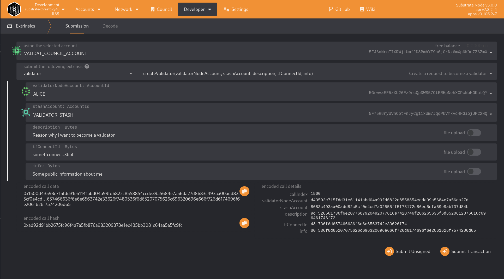

# Adding validators to an existing Tfchain network

## Prerequisites

- Subkey: https://docs.substrate.io/v3/tools/subkey/
- Hardware to run a Validator node on (6 cpu, 16gig ram, atleast 2TB storage)
- Docker installed on your hardware

# 1: Create a new key:

```
subkey generate --scheme sr25519
```

Take note of the SS58 address.

Transfer some balance to the new address. (0.1 TFT should be enough)

# 2: Create node-key
```sh
subkey generate-node-key
```

# 3: Run TFchain

Create /storage dir and allow a user to write

```sh
mkdir /storage
chown -R <username>:<username> /storage/
```

$NETWORK is either: `dev`, `test` or `main`

Start 2 containers to set keys in /storage, these will stop immediately

```sh
docker run -v /storage/:/storage/ dylanverstraete/tfchain key insert --base-path /storage --chain /etc/chainspecs/$NETWORK/chainSpecRaw.json --key-type aura --suri "<output_words_of_step1>"
docker run -v /storage/:/storage/ dylanverstraete/tfchain key insert --base-path /storage --chain /etc/chainspecs/$NETWORK/chainSpecRaw.json --key-type gran --suri "<output_words_of_step1>" --scheme ed25519
```

Start the node, change the name and add the correct node-key (generated via 'subkey generate-node-key', second one)

- Devnet bootnode: /ip4/185.206.122.7/tcp/30333/p2p/12D3KooWLcMLBg9itjQL1EXsAqkJFPhqESHqJKY7CBKmhhhL8fdp
- Testnet bootnode: /ip4/51.68.204.40/tcp/30333/p2p/12D3KooWQv76DZxtZGb7XYXYFGN5xePoDeiMnnp17roJokhsbVSe
- Mainnet bootnode: /ip4/185.206.122.83/tcp/30333/p2p/12D3KooWLtsdtQHswnXkLRH7e8vZJHktsh7gfuL5PoADV51JJ6wY

```sh
docker run -d -v /storage/:/storage/ --name SOME_NAME --network host dylanverstraete/tfchain --name SOME_TFCHAIN_NODE_NAME --base-path /storage --chain /etc/chainspecs/$NETWORK/chainSpecRaw.json --validator --bootnodes BOOTNODE_FROM_NETWORK --rpc-cors all --node-key <node_key> --ws-external
```

# 4: Generate session key

Connect to the new node deployed with polkadot js apps. You will need to install a local version of this application since you will have to connect over a not secured websocket.

```
git clone git@github.com:polkadot-js/apps.git
yarn
yarn start
```

Browse to http://localhost:3000 and connect to the new node over it's public ip.

Go to `rpc` -> `session` -> `rotateKeys`, excecute it and take note of the output.

On the same new node, go to `extrinsics` -> `session` -> `setKeys`, Make sure you execute it this with the newly generated keypair (step 1).
To sign with the keypair generated in step1, in polkadotjs browser go to `accounts` -> `Add Account` -> paste mnemonic and give it a name and continue. You can now use this account to sign.

input:
```
keys: the key from rotate keys ouput
proofs: 0
```

# 5: Create a Validator object

- dev: https://polkadot.js.org/apps/?rpc=wss%3A%2F%2Ftfchain.dev.grid.tf#/explorer
- test: https://polkadot.js.org/apps/?rpc=wss%3A%2F%2Ftfchain.test.grid.tf#/explorer
- main: https://polkadot.js.org/apps/?rpc=wss%3A%2F%2Ftfchain.grid.tf#/explorer

Open polkadot js link in the browser based on the network you want to validate on.

Browse to accounts and click `Add Account`, generate an account. Take note of the mnemonic.

This account will be your account that manages the Validator and manages your council membership (voting).
Create another account and name it `ANYNAME_STASH`. This account will be your stash account.
Now you should have 2 accounts.

Now go to `Developer` -> `Extrinsicis` and Select your `Stash` account. Now from the left dropdown (modules) search `validator`


Select `bond(validator)` and select the target account to be your account that manages the Validator and manages your council membership (voting). (You previously created).

Now click `Submit Transaction`.

To continue click on `bond(v..)` to select another method, in the list search for: `createValidator(...)`.



This call needs to be signed with your account that manages the Validator and manages your council membership (voting). (You previously created).

Information needed:

- validator_node_account: Account ID generated from Step 1 (top of this document)
- stash_account: Stash account (previously created)
- description: Reason why I want to become a validator
- tfconnectid: Your Threefold connect name
- info: link to webpage or linked in profile

If all information is filled in correctly. Click on `Submit transaction` and sign. If all goes well, the Council will approve your request.

# 6: Start validating

If your request is approved by the council AND your tfchain node is fully synced with the network you can activate your validator. This will kickstart block production.

Now go to `Developer` -> `Extrinsicis` and Select your account that manages the Validator and manages your council membership (voting). (You previously created).. Now from the left dropdown (modules) search `validator`.


Select `ActivateValidatorNode` and click Submit Transaction. You node should now be creating block after a couple of seconds.
